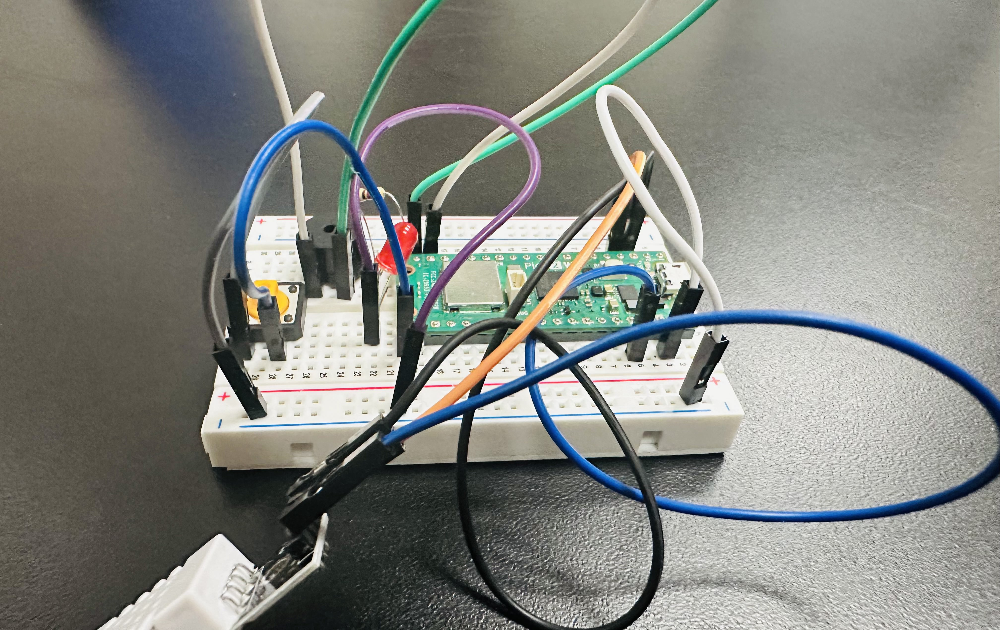

# Lab 09: Environmental Monitoring Dashboard with Git Workflow

## Table of Contents

- [Overview](#overview)
- [Learning Objectives](#learning-objectives)
- [Hardware Requirements](#hardware-requirements)
  - [Pin Connections](#pin-connections)
  - [Pico Pinout Reference](#pico-pinout-reference)
  - [Board Setup Photo](#board-setup-photo)
  - [Testing Hardware](#testing-hardware)
- [Git Workflow for This Lab](#git-workflow-for-this-lab)
  - [Part 1: Setting Up Your Branch](#part-1-setting-up-your-branch)
  - [Part 2: Peer Code Review](#part-2-peer-code-review)
  - [Part 3: Addressing Review Feedback](#part-3-addressing-review-feedback)
  - [Part 4: Merging](#part-4-merging)
- [Program Requirements](#program-requirements)
  - [File 1: environment_sensor.py](#file-1-srcenvironment_sensorpy-)
  - [File 2: dashboard_controller.py](#file-2-srcdashboard_controllerpy-)
  - [File 3: main.py](#file-3-srcmainpy--provided---no-changes-needed)
  - [File 4: reflection.md](#file-4-writingreflectionmd)
- [Assessment Criteria](#assessment-criteria)
- [Resources](#resources)

## Overview

In this lab, you will create an Environmental Monitoring Dashboard that combines the temperature sensor from Lab 08 with interactive hardware from Lab 06 (LED, button). You will practice object-oriented programming by creating two classes: `EnvironmentSensor` and `DashboardController`.

**Important:** This lab emphasizes **collaborative Git workflow**. You will work individually on your code but must:
- Create a feature branch for each class
- Submit a Pull Request (PR) for review
- Get approval from **two assigned peer reviewers**
- Review **two other students' PRs** (part of your grade!)

## Learning Objectives

- Design and implement classes with multiple methods
- Work with various data types (strings, integers, floats, booleans, lists, dictionaries)
- Integrate hardware sensors and controls
- Practice professional Git workflow with branches and pull requests
- Provide constructive code reviews

## Hardware Requirements

From **Lab 08:**
- DHT22 Temperature/Humidity Sensor
- Passive Buzzer

From **Lab 06:**
- LED
- Button

**New for Lab 09:**
- No new hardware needed! We are combining previous setups.

### Pin Connections

Here is the complete wiring setup for this lab:

| Component | Pin Connection | Notes |
|-----------|---------------|-------|
| DHT22 Sensor | GPIO 2 | Temperature/Humidity sensor |
| LED | GPIO 15 | Visual indicator for alerts |
| Button | GPIO 16 | Cycles through display modes |
| Passive Buzzer | GPIO 14 | Audible alert |
| Ground (GND) | Any GND pin | Common ground for all components |
| 3.3V Power | 3V3(OUT) | Power for DHT22 sensor |

### Pico Pinout Reference


### Board Setup Photo



*Your wiring should look similar to the setup shown above.*

### Testing Hardware

Use test files in `tests/` folder to test your hardware:

- `test_button_led.py` - Test button reading and LED control
- `test_buzzer.py` - Test buzzer alert sounds
- `test_environment_read.py` - Test reading DHT22

## Git Workflow for This Lab

### Part 1: Setting Up Your Branch

1. **Clone the repository** (if not already done):

2. **Create and switch to a feature branch**:
   ```bash
   git checkout -b environment-dashboard
   ```

3. **Work on your implementation** (see Program Requirements below)

4. **Commit frequently with descriptive messages**:
   ```bash
   git add src/environment_sensor.py
   git commit -m "Add EnvironmentSensor class with read_conditions method"
   ```

5. **Push your branch to GitHub**:
   ```bash
   git push -u origin environment-dashboard
   ```

6. **Create a Pull Request** on GitHub:
   - Go to your repository on GitHub
   - Click "Pull Requests" → "New Pull Request"
   - Set base: `main`, compare: `environment-dashboard`
   - Write a clear PR description explaining your changes
   - Request reviews from your **two assigned peer reviewers**

### Part 2: Peer Code Review

You will be assigned **two other students' PRs** to review (see Discord message). For each PR:

1. **Read the code carefully** in the "Files changed" tab
2. **Test the code** if possible (optional but recommended)
3. **Leave constructive comments**:
   - ✅ Point out good practices
   - 🤔 Ask questions about unclear code
   - 💡 Suggest improvements
   - 🐛 Identify potential bugs
   - 📝 Check for proper docstrings and comments

4. **Approve or Request Changes**:
   - If code looks good: Click "Review changes" → "Approve"
   - If improvements needed: Click "Request changes" with specific feedback

### Part 3: Addressing Review Feedback

1. **Read reviewer comments** on your PR
2. **Make requested changes** in your feature branch:
   ```bash
   git checkout feature/environment-dashboard
   # Make your edits
   git add .
   git commit -m "Address review feedback: improve error handling"
   git push
   ```

3. **Respond to comments** on GitHub
4. **Request re-review** once changes are made

### Part 4: Merging

Once you have **two approvals**:
1. **Merge your PR** on GitHub (click "Merge pull request")
2. **Delete your feature branch** (GitHub will prompt you)
3. **Update your local main**:
   ```bash
   git checkout main
   git pull origin main
   ```

## Program Requirements

**You only need to complete TWO Python files!** The complete `main.py` file is provided for you.

### File 1: `src/environment_sensor.py` 🌡️

Complete the `EnvironmentSensor` class that manages temperature/humidity sensor readings.

**Attributes:**
- `location` (string) - e.g., "LAB_A", "ROOM_101"
- `temp_pin` (int) - GPIO pin for DHT22
- `reading_history` (list of dictionaries) - stores recent readings

**Methods to Implement:**
- `__init__(self, location, temp_pin)` - Initialize sensor
- `read_temperature(self)` - Read temp/humidity from DHT22, return dictionary
- `read_conditions(self)` - Read temperature sensor, return dictionary with all data
- `add_to_history(self, reading)` - Add reading to history list (keep last 10)
- `get_average_temp(self)` - Calculate average temperature from history
- `get_status_summary(self)` - Return string describing current conditions
- `check_alerts(self)` - Return dictionary of alert conditions (temp > 28, humidity > 70)

**Programming Concepts Used:**
- Variables: strings, integers, floats, booleans
- List to store reading history
- Dictionary to organize sensor data
- If statements for alert checking
- Loop to calculate averages

**Data Structures:**
- `reading_history` - **List of dictionaries**: Stores the last 10 sensor readings. Each reading is a dictionary containing location, temperature, humidity, and timestamp.
  - Example: `[{'location': 'LAB_A', 'temperature': 22.5, 'humidity': 45.0, 'timestamp': '14:30:15'}, ...]`
- `read_conditions()` returns a **dictionary** with keys: `location` (string), `temperature` (float), `humidity` (float), `timestamp` (string)
- `check_alerts()` returns a **dictionary** with keys: `high_temp` (bool), `low_temp` (bool), `high_humidity` (bool), `any_alerts` (bool)

### File 2: `src/dashboard_controller.py` 💡

Complete the `DashboardController` class that manages LED, button, and buzzer hardware.

**Attributes:**
- `led_pin` (int) - GPIO pin for LED
- `button_pin` (int) - GPIO pin for button
- `buzzer_pin` (int) - GPIO pin for buzzer
- `display_mode` (string) - "temperature", "alerts", "history"
- `alert_active` (boolean) - whether alerts are currently triggered
- `button_press_count` (int) - how many times button was pressed
- `mode_history` (list) - track which modes were viewed

**Methods to Implement:**
- `__init__(self, led_pin, button_pin, buzzer_pin)` - Initialize LED, button, and buzzer
- `set_led_state(self, is_on)` - Turn LED on/off based on boolean
- `blink_led(self, times, delay)` - Blink LED specified number of times
- `read_button(self)` - Check if button is pressed, return boolean
- `cycle_display_mode(self)` - Change to next display mode when button pressed
- `sound_buzzer(self, duration)` - Sound buzzer for alert (duration in milliseconds)
- `indicate_alert(self, alert_data)` - Blink LED and sound buzzer if alerts exist
- `get_mode_stats(self)` - Return dictionary with button presses and mode usage
- `reset_stats(self)` - Clear button press count and mode history

**Programming Concepts Used:**
- Variables: strings, integers, booleans
- List to track mode history
- Dictionary to return statistics
- If statements for mode switching
- Loop for LED blinking

**Data Structures:**
- `mode_history` - **List of strings**: Tracks which display modes have been viewed in order.
  - Example: `['temperature', 'alerts', 'temperature', 'history', 'alerts']`
- `display_mode` - **String**: Current mode, one of `'temperature'`, `'alerts'`, or `'history'`
- `get_mode_stats()` returns a **dictionary** with keys: `button_press_count` (int), `mode_history` (list), `current_mode` (string)
- Alert methods work with **dictionaries** from `EnvironmentSensor.check_alerts()` containing boolean values

### File 3: `src/main.py` ✅ (Provided - No Changes Needed!)

The main program is **already complete** and provided for you! It:

1. **Initializes** multiple sensor and dashboard objects
2. **Runs a loop** that:
   - Reads button state
   - Cycles display mode when button pressed
   - Reads environment conditions from all sensors
   - Checks for alerts
   - Displays information based on current mode
   - Indicates alerts with LED and buzzer
   - Adds readings to history
   - Waits 2 seconds

3. **Display modes:**
   - "temperature": Shows temp and humidity
   - "alerts": Shows any active alerts
   - "history": Shows average temp from last 10 readings

**Your task:** Focus on implementing the two classes correctly so `main.py` works!

### File 4: `writing/reflection.md`

Answer reflection questions about:
- Object-oriented design choices
- Git workflow experience
- Code review process (giving and receiving feedback)
- Challenges with hardware integration
- What you learned about branches and PRs

## Assessment Criteria

### Technical Implementation (3 points)
- **Automated GatorGrade checks:** All required classes and methods implemented correctly
- **EnvironmentSensor class:** All 7 methods functional with proper dictionary/list usage
- **DashboardController class:** All 9 methods functional with proper state management
- **Main program integration:** Display modes work correctly, sensors read properly
- **Code quality:** Clean code with docstrings, error handling, proper variable types
- **Code Correctness:** Code runs as expected during code review

### Git Workflow and Code Review (1 point)
- **Branch creation:** Proper feature branch with descriptive name
- **Commit quality:** Multiple commits with clear, descriptive message
- **Pull Request:** Well-written PR description explaining changes
- **Code reviews given:** Two thorough, constructive reviews of peers' PRs
- **Addressing feedback:** Responded professionally to review comments

### Reflection (0.5 points)
- Personal insights on OOP design decisions and class structure
- Detailed reflection on Git workflow and PR process
- Thoughtful analysis of giving and receiving code reviews
- Honest assessment of hardware integration challenges
- What you learned about professional collaboration workflows

## Resources

- [Git Branching Guide](../materials/git_branching.md)
- [Pull Request Best Practices](../materials/pull_requests.md)
- [Code Review Checklist](../materials/code_review.md)
- Lab 08 sensor code (temperature and light reading)
- Lab 06 LED and button code
